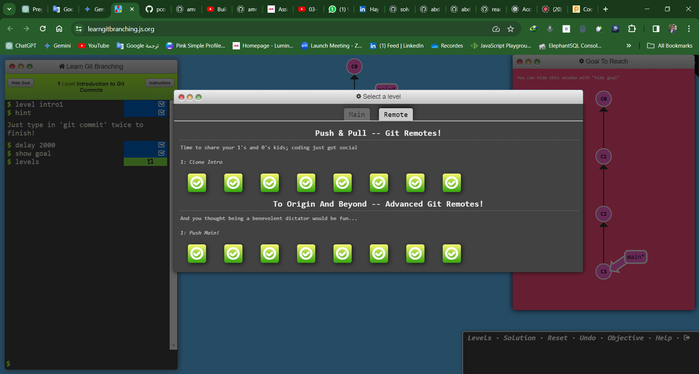
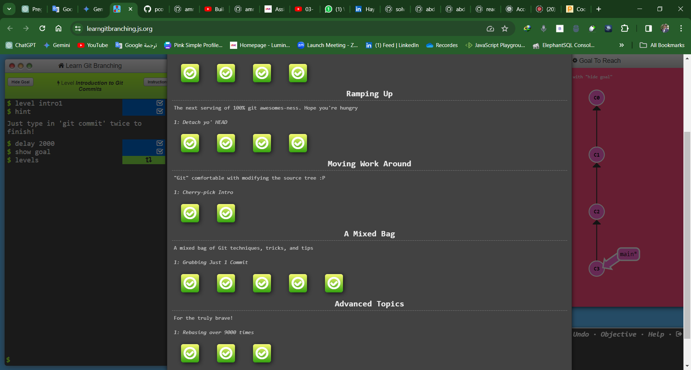
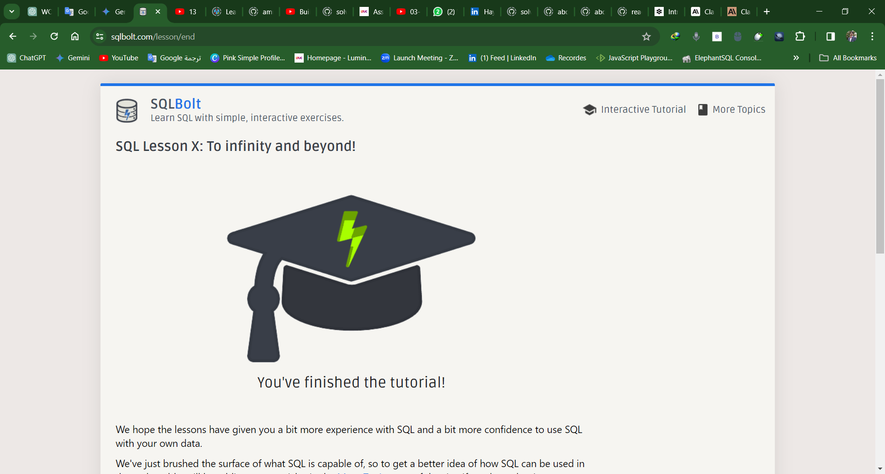

# Practices

# Linux Command Line Basics

## Introduction to Linux Command Line

### What is the Command Line?

The command line, also known as the terminal or shell, is a text-based interface for interacting with a computer's operating system.

### How does it work?

Users interact with the system by typing commands and receiving text-based feedback.

### How to Access the Command Line

To access the command line in Linux:

- **Terminal Emulator**: Most Linux distributions
  come with a terminal emulator installed.
- **SSH**: If accessing a remote Linux server, use Secure Shell (SSH) to connect.

## Basic Navigation in Linux

### Introduction to the Linux Directory System

Linux file system is structured hierarchically with the root directory ("/") at the top.

### Navigating the Directory System

- `pwd`: Print current working directory.
- `ls`: List files and directories.
- `cd`: Change directory.
- `mkdir`: Make directories.
- `rmdir`: Remove directories.
- `cp`: Copy files and directories.
- `mv`: Move (rename) files and directories.

## More About Files and Directories in Linux

### Characteristics of Files and Directories

- **Permissions**
- **Ownership**
- **Size**
- **Type**
- **Timestamps**

## Manual Pages in Linux

### Making the Most of Linux Commands

- `man`: Access manual pages.
- `info`: Access additional documentation.
- `--help` option: Display brief usage information.

## File Manipulation in Linux

### Creating, Removing, Renaming, Copying, and Moving Files

- `touch`: Create empty files or update timestamps.
- `rm`: Remove files and directories.
- `mv`: Move (rename) files and directories.
- `cp`: Copy files and directories.

## Cheat Sheet

- **Navigation**:
  - `pwd`
  - `ls`
  - `cd`
- **File Operations**:
  - `touch`
  - `rm`
  - `mv`
  - `cp`

[Professional Etiquette & Analysis](https://docs.google.com/document/d/1a_AnEUFyoQgV0Pid7YEB1C4FiVSR1Z8ZdYb90OK2bkE/edit?usp=sharing)

## Assignment Submission - Week 1

### Level Up Your Skills: Mastering the Art of Learning

So, there's this cool concept called deliberate practice, brought to you by the brainiac Cal Newport. It's all about stepping out of your comfort zone to really nail down those skills. Here's how it plays out in the coding world:

- **Ditch the Boring Stuff**: Don't just keep building the same ol' apps. Focus on the tricky bits and break 'em down for some serious practice.
- **Challenge Accepted**: When's the last time you tackled a brain-busting coding problem? It's time to flex those mental muscles!
- **Craft Your Challenges**: Since you're your own boss here, set up challenges that hit the sweet spot:
  - _Just a Tad Tough_: Not a walk in the park, but doable.
  - _Repeat, Repeat, Repeat_: Keep at it until it's second nature.
  - _Feedback Loop_: Code either works or it doesn't—pretty straightforward.
  - _Brain Workout_: You should feel like you just ran a marathon, but for your brain.
  - _Learn Something New_: Each challenge should teach you something cool.
- **Chart Your Progress**: Keep tabs on how you're doing so you know where to focus.
- **Get Some Feedback**: Don't be shy—ask the pros for their thoughts on your work.
- **Learn from Mistakes**: When you mess up (it happens to the best of us), take a sec to figure out what went wrong. It's all about that growth mindset!

### Embracing the 'Power of Yet'

This speaker is all about the "power of yet" in schools, advocating for a mindset where failure is seen as an opportunity to grow. They emphasize the importance of praising effort over innate talent. The speaker provides examples of schools where adopting this mindset significantly improved students' academic performance. Ultimately, they argue for creating learning environments that foster growth and view failure as a necessary step towards success.

### Unlocking Success: The Power of Grit in Education

It's all about grit - that determination to stick with your goals. The speaker shifted from a tough job to teaching and found that grit is crucial for success. But teaching grit is still a puzzle. They talk about "growth mindset" but need more testing. Basically, they're saying grittier kids are essential for success.

### Emotional Intelligence Self-Assessment Results

| Category             | Score | Ratings                                                                                                           |
|----------------------|-------|-------------------------------------------------------------------------------------------------------------------|
| Self-Awareness       | 25    | 1. Always, 5. Always, 9. Always, 12. Always, 15. Always                                                           |
| Self-Management      | 23    | 3. Always, 6. Usually, 10. Usually, 13. Always, 18. Always                                                        |
| Social Awareness     | 24    | 4. Always, 7. Always, 14. Usually, 17. Always, 19. Always                                                         |
| Relationship Management | 24 | 2. Always, 8. Always, 11. Always, 16. Usually, 20. Always                                                        |

Looks like I'm pretty in tune with my emotions and how they affect others. I've got high scores across the board, which suggests I'm good at understanding myself, managing my feelings, and connecting with others. Seems like I'm on the right track with my emotional intelligence.

[Behavioral Questions](https://docs.google.com/document/d/1cTKBdp6UvZxJYIc491PAM65TQYOPuVQvt1TXH7OjSCk/edit?usp=sharing)

[Target Companies](https://docs.google.com/spreadsheets/d/1Mg1B1IbgsdlLB53e_ciIGldqCHSRcEMKcUEMHFyPuWU/edit?usp=sharing)